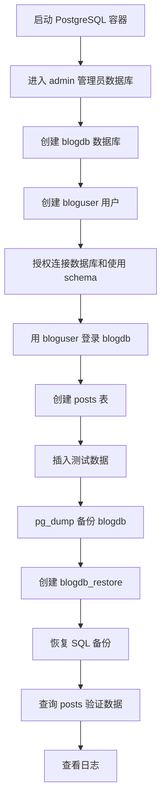
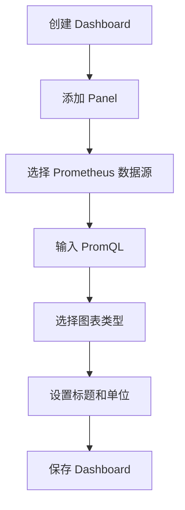
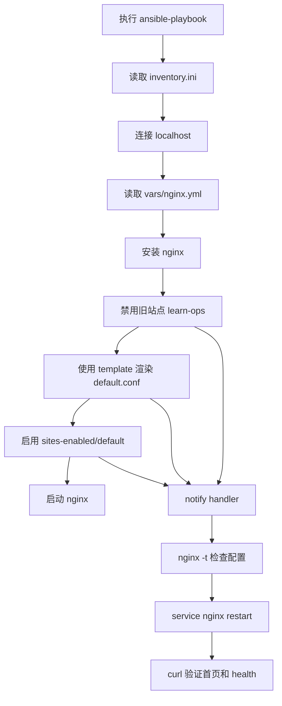
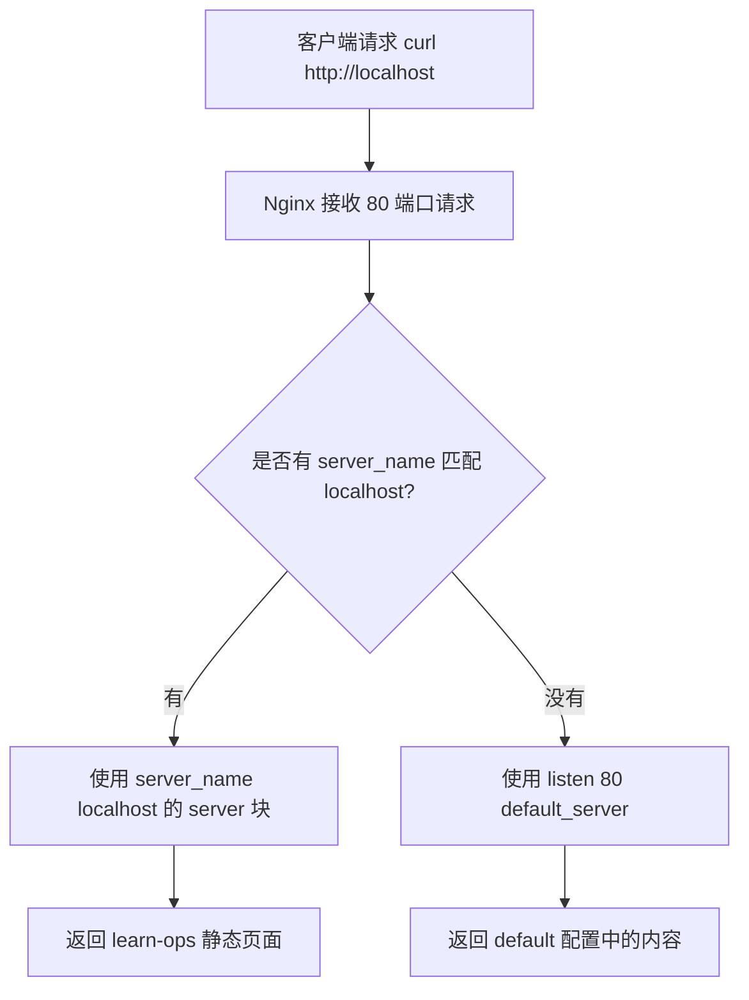

# 运维入门综合学习笔记：Docker、PostgreSQL、Prometheus/Grafana、Ansible 与 Nginx 自动化

> 适用对象：刚开始学习 Linux / Docker / 数据库 / 监控 / Ansible 自动化运维的初学者。  
> 学习目标：从“手动部署”逐步过渡到“自动化部署”和“可观测监控”，理解每一步背后的原理，并能应对常见面试问题。

---

## 目录

1. [整体学习路线](#1-整体学习路线)
2. [Docker 与 PostgreSQL 基础问题排查](#2-docker-与-postgresql-基础问题排查)
3. [阶段 11：使用 Docker Compose 管理 PostgreSQL](#3-阶段-11使用-docker-compose-管理-postgresql)
4. [阶段 12：PostgreSQL 综合运维练习](#4-阶段-12postgresql-综合运维练习)
5. [Docker 日志查看与常见误区](#5-docker-日志查看与常见误区)
6. [Prometheus + Grafana + Node Exporter 监控体系](#6-prometheus--grafana--node-exporter-监控体系)
7. [Grafana 创建 Dashboard 的步骤](#7-grafana-创建-dashboard-的步骤)
8. [Ansible 自动化运维学习路线](#8-ansible-自动化运维学习路线)
9. [Ansible 第八阶段：tasks](#9-ansible-第八阶段tasks)
10. [Ansible 第九阶段：handlers](#10-ansible-第九阶段handlers)
11. [Ansible 第十阶段：templates](#11-ansible-第十阶段templates)
12. [Ansible 第十一阶段：vars](#12-ansible-第十一阶段vars)
13. [Ansible 综合项目：一条命令自动部署 Nginx](#13-ansible-综合项目一条命令自动部署-nginx)
14. [Nginx 配置生效与站点匹配原理](#14-nginx-配置生效与站点匹配原理)
15. [常见故障与排错总结](#15-常见故障与排错总结)
16. [工作面试高频问题与参考答案](#16-工作面试高频问题与参考答案)
17. [后续学习路线建议](#17-后续学习路线建议)

---

# 1. 整体学习路线

你当前的学习路线可以分成四大块：

```text
Linux / Nginx / Docker 手动部署
        ↓
Docker Compose 管理服务
        ↓
Prometheus + Grafana 建立监控
        ↓
Ansible 把手动步骤自动化
```

更具体地说：

```text
1. 手动部署 Nginx
2. 手动运行 PostgreSQL 容器
3. 使用 Docker Compose 管理 PostgreSQL
4. 完成数据库建库、建用户、授权、备份、恢复
5. 使用 Prometheus + Node Exporter 采集主机指标
6. 使用 Grafana 做可视化 Dashboard
7. 使用 Ansible 自动安装 Nginx、复制配置、检查配置、重启服务
```

最终目标是具备一个基础运维工程师常见的闭环能力：

```text
部署能力 → 管理能力 → 监控能力 → 自动化能力 → 排错能力
```

---

# 2. Docker 与 PostgreSQL 基础问题排查

## 2.1 遇到的问题：旧容器停止但名字仍然占用

你之前执行：

```bash
docker exec -it postgres psql -U admin -d learnops
```

报错：

```text
Error response from daemon: container ... is not running
```

说明容器存在，但是没有运行。

后来执行：

```bash
docker run --name postgres ...
```

又报错：

```text
Conflict. The container name "/postgres" is already in use
```

说明：

```text
旧的 postgres 容器虽然停止了，但名字 postgres 仍然被占用。
```

## 2.2 查看所有容器

```bash
docker ps -a
```

只查看正在运行的容器：

```bash
docker ps
```

## 2.3 启动旧容器

```bash
docker start postgres
```

进入数据库：

```bash
docker exec -it postgres psql -U admin -d learnops
```

## 2.4 删除旧容器后重新创建

如果旧容器不需要了：

```bash
docker rm -f postgres
```

重新运行：

```bash
docker run --name postgres \
  -e POSTGRES_USER=admin \
  -e POSTGRES_PASSWORD=admin123 \
  -e POSTGRES_DB=learnops \
  -p 5432:5432 \
  -d postgres:16
```

## 2.5 Docker 容器名冲突的本质

Docker 容器名在同一台主机上必须唯一。

即使容器处于 `Exited` 状态，名字仍然占用。

所以：

```text
容器停止 ≠ 容器删除
```

停止容器：

```bash
docker stop postgres
```

删除容器：

```bash
docker rm postgres
```

强制删除：

```bash
docker rm -f postgres
```

---

# 3. 阶段 11：使用 Docker Compose 管理 PostgreSQL

## 3.1 为什么要使用 Docker Compose？

手动运行 PostgreSQL 需要写很长的命令：

```bash
docker run --name postgres \
  -e POSTGRES_USER=admin \
  -e POSTGRES_PASSWORD=admin123 \
  -e POSTGRES_DB=learnops \
  -p 5432:5432 \
  -d postgres:16
```

当服务越来越多时，这种方式不方便维护。

Docker Compose 的作用是把这些参数写进一个配置文件：

```yaml
compose.yaml
```

以后只需要：

```bash
docker compose up -d
```

就可以启动服务。

## 3.2 创建目录

```bash
cd /mnt/c/Users/Coffee
mkdir -p docker-compose-postgres
cd docker-compose-postgres
```

## 3.3 创建 compose.yaml

```bash
cat > compose.yaml <<'EOF'
services:
  postgres:
    image: postgres:16
    container_name: learn-postgres
    environment:
      POSTGRES_USER: admin
      POSTGRES_PASSWORD: admin123
      POSTGRES_DB: learnops
    ports:
      - "5432:5432"
    volumes:
      - pgdata:/var/lib/postgresql/data

volumes:
  pgdata:
EOF
```

## 3.4 配置解释

```yaml
services:
```

表示要定义服务。

```yaml
postgres:
```

这是服务名。Compose 命令中一般使用服务名，例如：

```bash
docker compose exec postgres ...
```

```yaml
image: postgres:16
```

表示使用 PostgreSQL 16 官方镜像。

```yaml
container_name: learn-postgres
```

表示容器名为 `learn-postgres`。

```yaml
environment:
  POSTGRES_USER: admin
  POSTGRES_PASSWORD: admin123
  POSTGRES_DB: learnops
```

表示初始化数据库用户、密码和数据库名。

```yaml
ports:
  - "5432:5432"
```

表示端口映射：

```text
宿主机 5432 → 容器 5432
```

```yaml
volumes:
  - pgdata:/var/lib/postgresql/data
```

表示把数据库数据保存在 Docker volume 中，防止容器删除后数据丢失。

## 3.5 启动服务

```bash
docker compose up -d
```

## 3.6 查看状态

```bash
docker compose ps
```

或者：

```bash
docker ps
```

## 3.7 查看日志

```bash
docker compose logs postgres
```

实时查看：

```bash
docker compose logs -f postgres
```

退出实时日志：

```text
Ctrl + C
```

## 3.8 进入数据库

```bash
docker compose exec postgres psql -U admin -d learnops
```

成功后会看到：

```text
learnops=#
```

## 3.9 关闭服务但保留数据

```bash
docker compose down
```

容器会删除，但 volume 还在，数据还在。

## 3.10 关闭服务并删除数据

```bash
docker compose down -v
```

`-v` 会删除 volume，数据库数据也会被删除。

真实环境中要谨慎使用。

---

# 4. 阶段 12：PostgreSQL 综合运维练习

## 4.1 项目目标

完成完整数据库运维流程：

```text
1. 用 Docker Compose 启动 PostgreSQL
2. 创建数据库 blogdb
3. 创建用户 bloguser
4. 授权 bloguser 访问 blogdb
5. 创建 posts 表
6. 插入 3 条文章数据
7. 查询当前连接
8. 备份 blogdb
9. 删除并重新创建 blogdb_restore
10. 把备份恢复到 blogdb_restore
11. 验证恢复后的数据
12. 查看 PostgreSQL 日志
```

## 4.2 启动 PostgreSQL

```bash
cd /mnt/c/Users/Coffee/docker-compose-postgres
docker compose up -d
docker compose ps
```

## 4.3 进入管理员数据库

```bash
docker compose exec postgres psql -U admin -d learnops
```

## 4.4 创建数据库、用户、授权

进入 psql 后执行：

```sql
CREATE DATABASE blogdb;

CREATE USER bloguser WITH PASSWORD 'blog123';

GRANT CONNECT ON DATABASE blogdb TO bloguser;

\c blogdb

GRANT USAGE ON SCHEMA public TO bloguser;

GRANT CREATE ON SCHEMA public TO bloguser;
```

解释：

```sql
CREATE DATABASE blogdb;
```

创建业务数据库。

```sql
CREATE USER bloguser WITH PASSWORD 'blog123';
```

创建业务用户。

```sql
GRANT CONNECT ON DATABASE blogdb TO bloguser;
```

允许用户连接数据库。

```sql
GRANT USAGE ON SCHEMA public TO bloguser;
```

允许用户使用 `public` schema。

```sql
GRANT CREATE ON SCHEMA public TO bloguser;
```

允许用户在 `public` schema 中创建表。

退出：

```sql
\q
```

## 4.5 用 bloguser 登录 blogdb

```bash
docker compose exec postgres psql -U bloguser -d blogdb
```

查看当前连接：

```sql
\conninfo
```

也可以执行：

```sql
SELECT current_database(), current_user;
```

## 4.6 创建 posts 表

```sql
CREATE TABLE posts (
    id SERIAL PRIMARY KEY,
    title TEXT NOT NULL,
    body TEXT,
    created_at TIMESTAMP DEFAULT now()
);
```

字段解释：

```text
id：文章编号，自动递增，主键
title：文章标题，不能为空
body：文章正文
created_at：创建时间，默认当前时间
```

## 4.7 插入 3 条数据

```sql
INSERT INTO posts (title, body)
VALUES
('first post', 'hello postgres'),
('docker note', 'postgres runs in docker'),
('backup note', 'use pg_dump');
```

## 4.8 查询数据

```sql
SELECT * FROM posts;
```

退出：

```sql
\q
```

## 4.9 备份 blogdb

在 Linux 终端执行，不是在 psql 里面执行：

```bash
docker exec learn-postgres pg_dump -U admin blogdb > blogdb.sql
```

查看备份文件：

```bash
ls
head blogdb.sql
```

## 4.10 删除并重新创建恢复数据库

```bash
docker exec -it learn-postgres psql -U admin -d postgres -c "DROP DATABASE IF EXISTS blogdb_restore;"
docker exec -it learn-postgres psql -U admin -d postgres -c "CREATE DATABASE blogdb_restore;"
```

## 4.11 恢复备份

```bash
cat blogdb.sql | docker exec -i learn-postgres psql -U admin -d blogdb_restore
```

注意这里使用：

```bash
-i
```

不是 `-it`，因为这里要通过管道传入 SQL 内容。

## 4.12 验证恢复结果

```bash
docker exec -it learn-postgres psql -U admin -d blogdb_restore
```

进入后：

```sql
\dt
SELECT * FROM posts;
SELECT COUNT(*) FROM posts;
```

如果返回 3 条数据，说明恢复成功。

## 4.13 查看 PostgreSQL 日志

```bash
docker compose logs postgres
```

实时查看：

```bash
docker compose logs -f postgres
```

## 4.14 PostgreSQL 运维流程图



---

# 5. Docker 日志查看与常见误区

## 5.1 错误命令

你曾经执行：

```bash
docker logs -f
```

报错：

```text
docker: 'docker logs' requires 1 argument
```

原因是：

```text
docker logs 后面必须跟容器名或容器 ID。
```

## 5.2 正确查看日志

先查看容器：

```bash
docker ps --format "table {{.ID}}\t{{.Image}}\t{{.Status}}\t{{.Names}}"
```

查看 PostgreSQL 日志：

```bash
docker logs learn-postgres
```

实时查看：

```bash
docker logs -f learn-postgres
```

只看最后 50 行：

```bash
docker logs --tail 50 learn-postgres
```

实时查看最后 50 行：

```bash
docker logs -f --tail 50 learn-postgres
```

## 5.3 Docker logs 与系统日志的区别

系统 Nginx 日志：

```bash
cd /var/log/nginx
du -sh *
```

这些是安装在 WSL / Linux 系统里的 Nginx 产生的日志。

Docker 容器日志要用：

```bash
docker logs 容器名
```

例如：

```bash
docker logs learn-postgres
```

---

# 6. Prometheus + Grafana + Node Exporter 监控体系

## 6.1 三个组件的作用

### Node Exporter

Node Exporter 负责暴露主机指标，例如 CPU、内存、磁盘、网络。

默认地址：

```text
http://localhost:9100/metrics
```

常见指标：

```text
node_cpu_seconds_total
node_memory_MemAvailable_bytes
node_filesystem_avail_bytes
node_network_receive_bytes_total
```

### Prometheus

Prometheus 负责定期抓取指标并存储时间序列数据。

默认地址：

```text
http://localhost:9090
```

### Grafana

Grafana 负责连接 Prometheus，把数据画成图表。

默认地址：

```text
http://localhost:3000
```

## 6.2 监控架构图


## 6.3 创建项目目录

```bash
cd /mnt/c/Users/Coffee
mkdir -p monitoring-lab
cd monitoring-lab
mkdir -p prometheus
mkdir -p grafana/provisioning/datasources
```

## 6.4 创建 Prometheus 配置

```bash
cat > prometheus/prometheus.yml <<'EOF'
global:
  scrape_interval: 15s
  evaluation_interval: 15s

rule_files:
  - /etc/prometheus/alert.rules.yml

scrape_configs:
  - job_name: "prometheus"
    static_configs:
      - targets: ["prometheus:9090"]

  - job_name: "node-exporter"
    static_configs:
      - targets: ["node-exporter:9100"]
EOF
```

重点：

```yaml
targets: ["node-exporter:9100"]
```

在 Docker Compose 网络中，服务之间通过服务名通信，不要写 `localhost:9100`。

## 6.5 创建告警规则

```bash
cat > prometheus/alert.rules.yml <<'EOF'
groups:
  - name: host-basic-alerts
    rules:
      - alert: InstanceDown
        expr: up == 0
        for: 1m
        labels:
          severity: critical
        annotations:
          summary: "Instance {{ $labels.instance }} is down"
          description: "Prometheus cannot scrape {{ $labels.job }} at {{ $labels.instance }}."

      - alert: HighCPUUsage
        expr: 100 * (1 - avg by(instance)(rate(node_cpu_seconds_total{mode="idle"}[5m]))) > 80
        for: 5m
        labels:
          severity: warning
        annotations:
          summary: "High CPU usage on {{ $labels.instance }}"
          description: "CPU usage is above 80% for 5 minutes."

      - alert: HighMemoryUsage
        expr: 100 * (1 - node_memory_MemAvailable_bytes / node_memory_MemTotal_bytes) > 80
        for: 5m
        labels:
          severity: warning
        annotations:
          summary: "High memory usage on {{ $labels.instance }}"
          description: "Memory usage is above 80% for 5 minutes."

      - alert: HighDiskUsage
        expr: 100 * (1 - node_filesystem_avail_bytes{mountpoint="/",fstype!~"tmpfs|overlay"} / node_filesystem_size_bytes{mountpoint="/",fstype!~"tmpfs|overlay"}) > 80
        for: 5m
        labels:
          severity: warning
        annotations:
          summary: "High disk usage on {{ $labels.instance }}"
          description: "Disk usage of root filesystem is above 80% for 5 minutes."
EOF
```

## 6.6 创建 Grafana 数据源配置

```bash
cat > grafana/provisioning/datasources/datasource.yml <<'EOF'
apiVersion: 1

datasources:
  - name: Prometheus
    type: prometheus
    access: proxy
    url: http://prometheus:9090
    isDefault: true
    editable: true
EOF
```

注意：

```text
http://prometheus:9090
```

不要写：

```text
http://localhost:9090
```

因为在 Grafana 容器里，`localhost` 指的是 Grafana 自己，不是 Prometheus。

## 6.7 创建 compose.yaml

在 WSL + Docker Desktop 环境中，推荐使用不带 `rslave` 的 Node Exporter 配置，避免：

```text
path / is mounted on / but it is not a shared mount
```

创建：

```bash
cat > compose.yaml <<'EOF'
services:
  prometheus:
    image: prom/prometheus:latest
    container_name: prometheus
    ports:
      - "9090:9090"
    volumes:
      - ./prometheus/prometheus.yml:/etc/prometheus/prometheus.yml:ro
      - ./prometheus/alert.rules.yml:/etc/prometheus/alert.rules.yml:ro
      - prometheus_data:/prometheus
    command:
      - "--config.file=/etc/prometheus/prometheus.yml"
      - "--storage.tsdb.path=/prometheus"
      - "--web.enable-lifecycle"
    restart: unless-stopped

  grafana:
    image: grafana/grafana:latest
    container_name: grafana
    ports:
      - "3000:3000"
    environment:
      - GF_SECURITY_ADMIN_USER=admin
      - GF_SECURITY_ADMIN_PASSWORD=admin123
    volumes:
      - grafana_data:/var/lib/grafana
      - ./grafana/provisioning/datasources:/etc/grafana/provisioning/datasources:ro
    depends_on:
      - prometheus
    restart: unless-stopped

  node-exporter:
    image: prom/node-exporter:latest
    container_name: node-exporter
    ports:
      - "9100:9100"
    volumes:
      - /proc:/host/proc:ro
      - /sys:/host/sys:ro
      - /:/rootfs:ro
    command:
      - "--path.procfs=/host/proc"
      - "--path.sysfs=/host/sys"
      - "--path.rootfs=/rootfs"
      - "--collector.filesystem.mount-points-exclude=^/(sys|proc|dev|host|etc|run|var/lib/docker/.+)($$|/)"
    restart: unless-stopped

volumes:
  prometheus_data:
  grafana_data:
EOF
```

## 6.8 启动监控系统

```bash
docker compose up -d
docker compose ps
```

应该看到：

```text
prometheus      Up
grafana         Up
node-exporter   Up
```

## 6.9 检查 Node Exporter

浏览器访问：

```text
http://localhost:9100/metrics
```

## 6.10 检查 Prometheus

浏览器访问：

```text
http://localhost:9090
```

查询：

```promql
up
```

正常结果：

```text
up{job="prometheus", instance="prometheus:9090"} 1
up{job="node-exporter", instance="node-exporter:9100"} 1
```

## 6.11 检查 Targets

Prometheus 页面：

```text
Status → Targets
```

目标状态应该都是：

```text
UP
```

## 6.12 检查 Grafana

浏览器访问：

```text
http://localhost:3000
```

账号：

```text
admin
```

密码：

```text
admin123
```

---

# 7. Grafana 创建 Dashboard 的步骤

## 7.1 确认数据源

进入：

```text
Connections → Data sources
```

找到 Prometheus，点击：

```text
Save & test
```

如果成功，会显示能够查询 Prometheus API。

## 7.2 创建 Dashboard

进入：

```text
Dashboards → New dashboard
```

点击右侧或中间的：

```text
Add panel
```

## 7.3 面板 1：服务存活状态

查询语句：

```promql
up
```

Visualization：

```text
Stat
```

标题：

```text
Service Status
```

含义：

```text
1 = 正常
0 = 异常
```

## 7.4 面板 2：CPU 使用率

查询语句：

```promql
100 * (1 - avg by(instance)(rate(node_cpu_seconds_total{mode="idle"}[5m])))
```

Visualization：

```text
Time series
```

单位：

```text
Percent (0-100)
```

标题：

```text
CPU Usage
```

## 7.5 面板 3：内存使用率

查询语句：

```promql
100 * (1 - node_memory_MemAvailable_bytes / node_memory_MemTotal_bytes)
```

标题：

```text
Memory Usage
```

单位：

```text
Percent (0-100)
```

## 7.6 面板 4：磁盘使用率

查询语句：

```promql
100 * (1 - node_filesystem_avail_bytes{mountpoint="/",fstype!~"tmpfs|overlay"} / node_filesystem_size_bytes{mountpoint="/",fstype!~"tmpfs|overlay"})
```

标题：

```text
Disk Usage
```

单位：

```text
Percent (0-100)
```

如果没有数据，先在 Prometheus 中查询：

```promql
node_filesystem_size_bytes
```

确认实际挂载点。

## 7.7 面板 5：网络接收流量

查询语句：

```promql
rate(node_network_receive_bytes_total{device!~"lo"}[5m])
```

标题：

```text
Network Receive
```

单位：

```text
bytes/sec
```

## 7.8 面板 6：网络发送流量

查询语句：

```promql
rate(node_network_transmit_bytes_total{device!~"lo"}[5m])
```

标题：

```text
Network Transmit
```

单位：

```text
bytes/sec
```

## 7.9 保存 Dashboard

点击右上角：

```text
Save
```

名称：

```text
Host Resource Monitoring
```

## 7.10 导入现成模板

如果希望直接导入成熟模板：

```text
Dashboards → New → Import
```

输入 Dashboard ID：

```text
1860
```

选择数据源：

```text
Prometheus
```

点击：

```text
Import
```

## 7.11 Grafana Dashboard 逻辑图



---

# 8. Ansible 自动化运维学习路线

## 8.1 Ansible 是什么？

Ansible 是自动化运维工具。

手动部署 Nginx：

```bash
sudo apt update
sudo apt install -y nginx
sudo cp default.conf /etc/nginx/sites-available/default
sudo nginx -t
sudo service nginx restart
```

写成 Ansible 后，一条命令执行：

```bash
ansible-playbook -i inventory.ini deploy-nginx.yml -K
```

自动完成：

```text
安装 Nginx
复制配置文件
检查配置
重启服务
```

## 8.2 核心概念

```text
inventory      管理哪些机器
ansible ping   测试能不能连接机器
playbook       自动化脚本
tasks          具体任务
handlers       被触发后才执行的任务
templates      配置模板
vars           变量
```

## 8.3 整体关系


## 8.4 安装 Ansible

```bash
sudo apt update
sudo apt install -y ansible
```

检查：

```bash
ansible --version
```

## 8.5 创建练习目录

```bash
cd ~
mkdir -p ansible-lab
cd ansible-lab
```

## 8.6 创建 inventory.ini

```bash
cat > inventory.ini <<'EOF'
[web]
localhost ansible_connection=local
EOF
```

测试主机列表：

```bash
ansible -i inventory.ini all --list-hosts
```

测试连接：

```bash
ansible -i inventory.ini all -m ping
```

## 8.7 sudo 密码问题

如果 playbook 中有：

```yaml
become: true
```

运行时需要加：

```bash
-K
```

例如：

```bash
ansible-playbook -i inventory.ini install-nginx.yml -K
```

`-K` 表示让 Ansible 提示输入 sudo 密码。

---

# 9. Ansible 第八阶段：tasks

## 9.1 tasks 的作用

`tasks` 是具体执行步骤。

例如：

```yaml
tasks:
  - name: Update apt cache
    apt:
      update_cache: true

  - name: Install nginx
    apt:
      name: nginx
      state: present
```

## 9.2 tasks 练习：安装 Nginx 并查看版本

创建：

```bash
cat > tasks-demo.yml <<'EOF'
- name: Learn Ansible tasks
  hosts: web
  become: true

  tasks:
    - name: Update apt cache
      apt:
        update_cache: true

    - name: Install nginx
      apt:
        name: nginx
        state: present

    - name: Check nginx version
      command: nginx -v
      register: nginx_version
      changed_when: false

    - name: Show nginx version
      debug:
        var: nginx_version.stderr
EOF
```

执行：

```bash
ansible-playbook -i inventory.ini tasks-demo.yml -K
```

## 9.3 register 的作用

```yaml
register: nginx_version
```

把命令结果保存到变量 `nginx_version`。

## 9.4 changed_when 的作用

```yaml
changed_when: false
```

表示这个任务只是查看信息，不改变系统状态，不应显示为 changed。

## 9.5 文件任务练习

```bash
cat > file-task-demo.yml <<'EOF'
- name: Learn file tasks
  hosts: web
  become: true

  tasks:
    - name: Create a test directory
      file:
        path: /tmp/ansible-demo
        state: directory
        mode: "0755"

    - name: Create a test file
      copy:
        dest: /tmp/ansible-demo/hello.txt
        content: "hello ansible tasks\n"
        mode: "0644"

    - name: Read the test file
      command: cat /tmp/ansible-demo/hello.txt
      register: file_content
      changed_when: false

    - name: Show file content
      debug:
        var: file_content.stdout
EOF
```

执行：

```bash
ansible-playbook -i inventory.ini file-task-demo.yml -K
```

## 9.6 常见 task 模块

```text
apt      安装软件
file     管理文件、目录、软链接
copy     复制文件或写入内容
template 渲染模板文件
command  执行普通命令
shell    执行 shell 命令
debug    打印变量
service  管理服务
uri      测试 HTTP 接口
```

---

# 10. Ansible 第九阶段：handlers

## 10.1 handlers 的作用

Handler 是“被触发才执行”的任务。

典型场景：

```text
配置文件变化 → 检查配置 → 重启服务
配置文件没变化 → 不重启服务
```

## 10.2 handler 练习

```bash
cat > handler-demo.yml <<'EOF'
- name: Handler demo
  hosts: web
  become: true

  tasks:
    - name: Install nginx
      apt:
        name: nginx
        state: present
        update_cache: true

    - name: Disable old learn-ops site
      file:
        path: /etc/nginx/sites-enabled/learn-ops
        state: absent
      notify: Check and restart nginx

    - name: Deploy simple nginx config
      copy:
        dest: /etc/nginx/sites-available/default
        content: |
          server {
              listen 80 default_server;
              server_name _;

              location / {
                  return 200 "hello from handlers demo\n";
              }

              location /health {
                  return 200 "ok\n";
              }
          }
        owner: root
        group: root
        mode: "0644"
      notify: Check and restart nginx

    - name: Ensure default site is enabled
      file:
        src: /etc/nginx/sites-available/default
        dest: /etc/nginx/sites-enabled/default
        state: link
        force: true
      notify: Check and restart nginx

    - name: Ensure nginx is started
      service:
        name: nginx
        state: started

  handlers:
    - name: Check and restart nginx
      shell: nginx -t && service nginx restart
EOF
```

执行：

```bash
ansible-playbook -i inventory.ini handler-demo.yml -K
```

测试：

```bash
curl http://localhost
curl http://localhost/health
```

期望结果：

```text
hello from handlers demo
ok
```

## 10.3 notify 与 handler 的关系

```yaml
notify: Check and restart nginx
```

表示如果当前任务发生 `changed`，就触发名为 `Check and restart nginx` 的 handler。

如果任务是 `ok`，没有 `changed`，handler 不会执行。

## 10.4 handler 的执行时机

Handler 通常在所有普通 tasks 执行完之后统一执行。

这避免了一个 playbook 中多个任务重复触发多次重启。

---

# 11. Ansible 第十阶段：templates

## 11.1 templates 的作用

模板用于生成配置文件。

它适合处理：

```text
端口不同
域名不同
返回内容不同
路径不同
环境不同
```

## 11.2 创建模板目录

```bash
mkdir -p templates
```

## 11.3 创建 Nginx 模板

```bash
cat > templates/nginx-default.conf.j2 <<'EOF'
server {
    listen {{ nginx_port }} default_server;
    server_name {{ server_name }};

    access_log /var/log/nginx/access.log;
    error_log /var/log/nginx/error.log;

    location / {
        return 200 "{{ nginx_message }}\n";
    }

    location /health {
        return 200 "{{ health_message }}\n";
    }
}
EOF
```

## 11.4 创建 template-demo.yml

```bash
cat > template-demo.yml <<'EOF'
- name: Learn Ansible templates
  hosts: web
  become: true

  vars:
    nginx_port: 80
    server_name: "_"
    nginx_message: "hello from ansible template"
    health_message: "ok"

  tasks:
    - name: Install nginx
      apt:
        name: nginx
        state: present
        update_cache: true

    - name: Disable old learn-ops site
      file:
        path: /etc/nginx/sites-enabled/learn-ops
        state: absent
      notify: Check and restart nginx

    - name: Deploy nginx config from template
      template:
        src: templates/nginx-default.conf.j2
        dest: /etc/nginx/sites-available/default
        owner: root
        group: root
        mode: "0644"
      notify: Check and restart nginx

    - name: Ensure default site is enabled
      file:
        src: /etc/nginx/sites-available/default
        dest: /etc/nginx/sites-enabled/default
        state: link
        force: true
      notify: Check and restart nginx

    - name: Ensure nginx is started
      service:
        name: nginx
        state: started

  handlers:
    - name: Check and restart nginx
      shell: nginx -t && service nginx restart
EOF
```

执行：

```bash
ansible-playbook -i inventory.ini template-demo.yml -K
```

测试：

```bash
curl http://localhost
curl http://localhost/health
```

## 11.5 查看渲染后的配置

```bash
sudo cat /etc/nginx/sites-available/default
```

你会看到变量已经被替换成真实值。

---

# 12. Ansible 第十一阶段：vars

## 12.1 vars 的作用

变量用于把可变内容单独抽离出来。

适合变量化的内容：

```text
软件包名
服务名
端口
域名
返回内容
路径
用户
环境名
```

## 12.2 在 playbook 中直接写 vars

```yaml
vars:
  nginx_port: 80
  server_name: "_"
  nginx_message: "hello from ansible vars"
```

## 12.3 使用 vars_files

创建目录：

```bash
mkdir -p vars
```

创建变量文件：

```bash
cat > vars/nginx.yml <<'EOF'
nginx_package: nginx
nginx_service: nginx
nginx_port: 80
server_name: "_"
nginx_message: "hello from external vars file"
health_message: "ok"
EOF
```

创建 playbook：

```bash
cat > vars-file-demo.yml <<'EOF'
- name: Learn external vars file
  hosts: web
  become: true

  vars_files:
    - vars/nginx.yml

  tasks:
    - name: Show variables from vars file
      debug:
        msg:
          - "Package is {{ nginx_package }}"
          - "Service is {{ nginx_service }}"
          - "Message is {{ nginx_message }}"

    - name: Install nginx
      apt:
        name: "{{ nginx_package }}"
        state: present
        update_cache: true

    - name: Disable old learn-ops site
      file:
        path: /etc/nginx/sites-enabled/learn-ops
        state: absent
      notify: Check and restart nginx

    - name: Deploy nginx config from template
      template:
        src: templates/nginx-default.conf.j2
        dest: /etc/nginx/sites-available/default
      notify: Check and restart nginx

    - name: Ensure default site is enabled
      file:
        src: /etc/nginx/sites-available/default
        dest: /etc/nginx/sites-enabled/default
        state: link
        force: true
      notify: Check and restart nginx

    - name: Ensure nginx is started
      service:
        name: "{{ nginx_service }}"
        state: started

  handlers:
    - name: Check and restart nginx
      shell: nginx -t && service nginx restart
EOF
```

执行：

```bash
ansible-playbook -i inventory.ini vars-file-demo.yml -K
```

测试：

```bash
curl http://localhost
curl http://localhost/health
```

## 12.4 为什么变量要加引号？

推荐写：

```yaml
name: "{{ nginx_package }}"
```

不要写：

```yaml
name: {{ nginx_package }}
```

因为 YAML 对以 `{{ }}` 开头的值可能解析出错。

---

# 13. Ansible 综合项目：一条命令自动部署 Nginx

## 13.1 目标

一条命令自动完成：

```text
1. 安装 Nginx
2. 禁用旧站点
3. 复制配置文件
4. 启用 default 站点
5. 检查配置
6. 重启服务
7. 验证首页
8. 验证 /health
```

## 13.2 创建项目结构

```bash
cd ~
mkdir -p ansible-nginx-project/{templates,vars}
cd ansible-nginx-project
```

结构：

```text
ansible-nginx-project/
├── inventory.ini
├── deploy-nginx.yml
├── templates/
│   └── default.conf.j2
└── vars/
    └── nginx.yml
```

## 13.3 创建 inventory.ini

```bash
cat > inventory.ini <<'EOF'
[web]
localhost ansible_connection=local
EOF
```

## 13.4 创建变量文件

```bash
cat > vars/nginx.yml <<'EOF'
nginx_package: nginx
nginx_service: nginx
nginx_port: 80
server_name: "_"
nginx_message: "hello from one command ansible deploy"
health_message: "ok"
old_site_name: learn-ops
EOF
```

## 13.5 创建 Nginx 模板

```bash
cat > templates/default.conf.j2 <<'EOF'
server {
    listen {{ nginx_port }} default_server;
    server_name {{ server_name }};

    access_log /var/log/nginx/access.log;
    error_log /var/log/nginx/error.log;

    location / {
        return 200 "{{ nginx_message }}\n";
    }

    location /health {
        return 200 "{{ health_message }}\n";
    }
}
EOF
```

## 13.6 创建 deploy-nginx.yml

```bash
cat > deploy-nginx.yml <<'EOF'
- name: Deploy Nginx with Ansible
  hosts: web
  become: true

  vars_files:
    - vars/nginx.yml

  tasks:
    - name: Update apt cache
      apt:
        update_cache: true

    - name: Install Nginx package
      apt:
        name: "{{ nginx_package }}"
        state: present

    - name: Disable old site
      file:
        path: "/etc/nginx/sites-enabled/{{ old_site_name }}"
        state: absent
      notify: Validate and restart Nginx

    - name: Deploy Nginx config from template
      template:
        src: templates/default.conf.j2
        dest: /etc/nginx/sites-available/default
        owner: root
        group: root
        mode: "0644"
      notify: Validate and restart Nginx

    - name: Ensure default site is enabled
      file:
        src: /etc/nginx/sites-available/default
        dest: /etc/nginx/sites-enabled/default
        state: link
        force: true
      notify: Validate and restart Nginx

    - name: Ensure Nginx service is started
      service:
        name: "{{ nginx_service }}"
        state: started

    - name: Test homepage
      uri:
        url: "http://localhost/"
        return_content: true
      register: homepage_result
      changed_when: false

    - name: Show homepage result
      debug:
        var: homepage_result.content

    - name: Test health endpoint
      uri:
        url: "http://localhost/health"
        return_content: true
      register: health_result
      changed_when: false

    - name: Show health result
      debug:
        var: health_result.content

  handlers:
    - name: Validate and restart Nginx
      shell: nginx -t && service nginx restart
EOF
```

## 13.7 检查语法

```bash
ansible-playbook -i inventory.ini deploy-nginx.yml --syntax-check
```

## 13.8 正式执行

```bash
ansible-playbook -i inventory.ini deploy-nginx.yml -K
```

## 13.9 验证

```bash
curl http://localhost
curl http://localhost/health
```

期望：

```text
hello from one command ansible deploy
ok
```

## 13.10 再执行一次观察幂等性

```bash
ansible-playbook -i inventory.ini deploy-nginx.yml -K
```

如果配置没有变化，`changed` 数量应减少。

## 13.11 修改变量观察自动更新

编辑：

```bash
nano vars/nginx.yml
```

修改：

```yaml
nginx_message: "nginx deployed automatically by ansible"
```

重新执行：

```bash
ansible-playbook -i inventory.ini deploy-nginx.yml -K
```

测试：

```bash
curl http://localhost
```

## 13.12 自动部署流程图



---

# 14. Nginx 配置生效与站点匹配原理

## 14.1 sites-available 与 sites-enabled

常见 Nginx 目录：

```text
/etc/nginx/sites-available/
```

存放可用配置。

```text
/etc/nginx/sites-enabled/
```

存放真正启用的配置，通常是指向 `sites-available` 的软链接。

查看启用配置：

```bash
sudo ls -l /etc/nginx/sites-enabled/
```

启用 default：

```bash
sudo ln -sf /etc/nginx/sites-available/default /etc/nginx/sites-enabled/default
```

禁用 learn-ops：

```bash
sudo rm -f /etc/nginx/sites-enabled/learn-ops
```

## 14.2 查看 Nginx 实际加载配置

```bash
sudo nginx -T
```

过滤关键信息：

```bash
sudo nginx -T | grep -n "configuration file /etc/nginx/sites-enabled"
```

查找 server_name / listen / location：

```bash
sudo nginx -T | grep -n "hello from\|health\|server_name\|listen 80" -A5 -B5
```

## 14.3 你遇到的具体问题

你当时有两个启用站点：

```text
/etc/nginx/sites-enabled/default
/etc/nginx/sites-enabled/learn-ops
```

`default` 中：

```nginx
server {
    listen 80 default_server;
    server_name _;

    location / {
        return 200 "hello from ansible nginx\n";
    }
}
```

`learn-ops` 中：

```nginx
server {
    listen 80;
    server_name localhost;

    root /var/www/learn-ops;
    index index.html;
}
```

访问：

```bash
curl http://localhost
```

请求的 Host 是：

```text
localhost
```

Nginx 优先匹配：

```nginx
server_name localhost;
```

所以请求进入 `learn-ops`，而不是 default。

## 14.4 Nginx server 匹配流程



## 14.5 为什么 /health 404？

因为最初 default 配置只有：

```nginx
location / {
    return 200 "hello from ansible nginx\n";
}
```

没有：

```nginx
location /health {
    return 200 "ok\n";
}
```

所以访问 `/health` 会 404。

如果请求被 `learn-ops` 站点接收，而该站点也没有 `/health`，同样会 404。

## 14.6 修改配置后必须检查并重启

每次修改 Nginx 配置后，应执行：

```bash
sudo nginx -t
sudo service nginx restart
```

Ansible 中通过 handler 实现：

```yaml
handlers:
  - name: Validate and restart Nginx
    shell: nginx -t && service nginx restart
```

---

# 15. 常见故障与排错总结

## 15.1 Docker 容器未运行

报错：

```text
container is not running
```

处理：

```bash
docker ps -a
docker start 容器名
```

或者删除重建：

```bash
docker rm -f 容器名
```

## 15.2 Docker 容器名冲突

报错：

```text
container name is already in use
```

处理：

```bash
docker rm -f 容器名
```

## 15.3 docker logs 缺少参数

错误命令：

```bash
docker logs -f
```

正确命令：

```bash
docker logs -f learn-postgres
```

## 15.4 Node Exporter shared mount 报错

报错：

```text
path / is mounted on / but it is not a shared mount
```

原因：

```text
WSL 环境中 / 不是 shared mount，不适合使用 /:/host:ro,rslave
```

解决：

```yaml
volumes:
  - /proc:/host/proc:ro
  - /sys:/host/sys:ro
  - /:/rootfs:ro
```

不要使用：

```yaml
- /:/host:ro,rslave
```

## 15.5 Grafana 连接 Prometheus 失败

错误原因：

```text
在 Grafana 容器里写了 http://localhost:9090
```

正确写法：

```text
http://prometheus:9090
```

## 15.6 Ansible sudo 密码错误

报错：

```text
sudo: a password is required
```

解决：

```bash
ansible-playbook -i inventory.ini playbook.yml -K
```

## 15.7 Handler 没有执行

现象：

```text
PLAY RECAP changed=0
```

原因：

```text
notify 只有在 task changed 时才触发 handler。
```

解决：

```text
确认 copy/template 任务是否真的修改了目标文件。
```

## 15.8 Nginx 配置修改了但访问还是旧页面

原因可能是：

```text
1. 没有重启 Nginx
2. sites-enabled 中启用了另一个更匹配的 server_name
3. 请求被其他 server 块接收
```

排查：

```bash
sudo nginx -T
sudo ls -l /etc/nginx/sites-enabled/
```

禁用旧站点：

```bash
sudo rm -f /etc/nginx/sites-enabled/learn-ops
sudo nginx -t
sudo service nginx restart
```

---

# 16. 工作面试高频问题与参考答案

## 16.1 Docker 相关

### Q1：Docker 容器停止和删除有什么区别？

**答：**

容器停止只是进程停止，容器本身仍然存在，容器名、文件系统、元数据还在。

删除容器才会真正移除容器对象。

常用命令：

```bash
docker stop 容器名
docker rm 容器名
docker rm -f 容器名
```

---

### Q2：为什么容器停止后，重新创建同名容器会失败？

**答：**

因为停止的容器仍然占用容器名。Docker 要求容器名唯一，所以必须先删除旧容器，或者换一个新名字。

---

### Q3：Docker Compose 的作用是什么？

**答：**

Docker Compose 用一个 YAML 文件定义多个容器服务，包括镜像、端口、环境变量、数据卷、网络等配置。它可以用一条命令启动、停止、管理整套服务。

常用命令：

```bash
docker compose up -d
docker compose ps
docker compose logs -f
docker compose down
docker compose down -v
```

---

### Q4：Docker volume 的作用是什么？

**答：**

Volume 用于持久化容器数据。容器删除后，volume 中的数据仍然可以保留，适合数据库等有状态服务。

PostgreSQL 中常挂载：

```yaml
volumes:
  - pgdata:/var/lib/postgresql/data
```

---

### Q5：`docker compose down` 和 `docker compose down -v` 有什么区别？

**答：**

`docker compose down` 删除容器和网络，但保留 volume。

`docker compose down -v` 还会删除 volume，因此数据库数据也会被删除。

---

## 16.2 PostgreSQL 相关

### Q6：PostgreSQL 中数据库用户和 schema 权限有什么区别？

**答：**

允许用户连接数据库，不代表用户能在 schema 中创建表。

需要分别授权：

```sql
GRANT CONNECT ON DATABASE blogdb TO bloguser;
GRANT USAGE ON SCHEMA public TO bloguser;
GRANT CREATE ON SCHEMA public TO bloguser;
```

---

### Q7：如何备份 PostgreSQL 数据库？

**答：**

可以使用 `pg_dump`：

```bash
docker exec learn-postgres pg_dump -U admin blogdb > blogdb.sql
```

---

### Q8：如何恢复 PostgreSQL 数据库？

**答：**

先创建空数据库：

```bash
docker exec -it learn-postgres psql -U admin -c "CREATE DATABASE blogdb_restore;"
```

再导入 SQL：

```bash
cat blogdb.sql | docker exec -i learn-postgres psql -U admin -d blogdb_restore
```

---

### Q9：为什么恢复时使用 `docker exec -i`，而不是 `-it`？

**答：**

因为恢复时通过管道把 SQL 内容传给容器，需要保持标准输入打开，因此使用 `-i`。`-t` 是分配伪终端，管道场景通常不需要。

---

## 16.3 Prometheus / Grafana 相关

### Q10：Prometheus 是什么？

**答：**

Prometheus 是一个监控和时序数据库系统。它通过定时拉取 exporter 暴露的指标，把数据保存为时间序列，并支持 PromQL 查询和告警规则。

---

### Q11：Node Exporter 是什么？

**答：**

Node Exporter 是 Prometheus 生态中的主机指标导出器，用于暴露 Linux 主机的 CPU、内存、磁盘、网络等指标。

---

### Q12：Grafana 是什么？

**答：**

Grafana 是可视化平台，可以连接 Prometheus 等数据源，把指标展示成 Dashboard 图表。

---

### Q13：Prometheus 的 `up` 指标表示什么？

**答：**

`up` 表示 Prometheus 是否成功抓取目标。

```text
up = 1 表示目标正常
up = 0 表示目标抓取失败
```

---

### Q14：Grafana 容器中为什么不能用 `localhost:9090` 连接 Prometheus？

**答：**

在容器中，`localhost` 指的是容器自身。Grafana 容器里的 `localhost:9090` 是 Grafana 容器自己，不是 Prometheus。Compose 网络中应使用服务名：

```text
http://prometheus:9090
```

---

### Q15：Prometheus 的 pull 模型是什么？

**答：**

Prometheus 默认采用 pull 模型，也就是 Prometheus 主动定期访问目标服务的 `/metrics` 接口拉取指标，而不是目标服务主动推送给 Prometheus。

---

## 16.4 Nginx 相关

### Q16：Nginx 的 `sites-available` 和 `sites-enabled` 有什么区别？

**答：**

`sites-available` 保存可用站点配置。

`sites-enabled` 保存真正启用的站点配置，通常是指向 `sites-available` 的软链接。

Nginx 只加载被 include 到主配置中的 enabled 配置。

---

### Q17：Nginx 如何匹配 server 块？

**答：**

Nginx 先根据监听端口匹配，再根据请求中的 Host 头匹配 `server_name`。如果没有匹配的 `server_name`，则使用该端口上的 `default_server`。

---

### Q18：为什么配置了 default_server，但访问 localhost 仍进入另一个站点？

**答：**

因为另一个站点配置了：

```nginx
server_name localhost;
```

当请求 Host 是 `localhost` 时，Nginx 会优先匹配这个 server，而不是 default_server。

---

### Q19：修改 Nginx 配置后为什么要先执行 `nginx -t`？

**答：**

`nginx -t` 用于检查配置语法。如果配置错误就直接重启，可能导致 Nginx 启动失败，影响服务。因此应先检查，再重启。

---

## 16.5 Ansible 相关

### Q20：Ansible 的 inventory 是什么？

**答：**

Inventory 是主机清单，用来定义 Ansible 要管理哪些主机，以及如何连接这些主机。

例如：

```ini
[web]
localhost ansible_connection=local
```

---

### Q21：Ansible ping 和系统 ping 一样吗？

**答：**

不一样。Ansible ping 是测试 Ansible 是否能连接目标主机并执行模块，返回 `pong` 表示 Ansible 控制通道正常。

---

### Q22：Ansible playbook 是什么？

**答：**

Playbook 是 Ansible 的自动化脚本，使用 YAML 编写，定义对哪些主机执行哪些任务。

---

### Q23：Ansible task 是什么？

**答：**

Task 是 playbook 中的具体执行步骤，例如安装软件、复制文件、启动服务等。

---

### Q24：Ansible handler 是什么？

**答：**

Handler 是被 notify 触发的任务，常用于配置文件变化后重启服务。只有触发它的任务发生 `changed` 时，handler 才会执行。

---

### Q25：为什么 handler 没有执行？

**答：**

因为触发 handler 的 task 没有发生变化，状态是 `ok` 而不是 `changed`。`notify` 只会在 changed 时触发 handler。

---

### Q26：Ansible template 和 copy 有什么区别？

**答：**

`copy` 用于复制静态文件或写入固定内容。

`template` 用于渲染带变量的 Jinja2 模板，适合动态生成配置文件。

---

### Q27：Ansible vars 有什么作用？

**答：**

vars 用于把变化的内容抽离出来，例如端口、域名、路径、软件包名等。这样同一个 playbook 可以适配不同环境。

---

### Q28：Ansible 的幂等性是什么？

**答：**

幂等性是指同一个 playbook 可以反复执行。如果系统已经达到目标状态，就不会重复修改。比如软件已经安装，Ansible 不会重复安装。

---

### Q29：`become: true` 是什么？

**答：**

`become: true` 表示任务需要提权执行，通常相当于 sudo。执行时如果需要 sudo 密码，要加：

```bash
-K
```

---

### Q30：Ansible 中 command 和 shell 有什么区别？

**答：**

`command` 直接执行命令，不经过 shell，不支持管道、重定向、`&&` 等 shell 特性。

`shell` 经过 shell 执行，支持管道、重定向、`&&` 等。

例如：

```yaml
command: nginx -v
shell: nginx -t && service nginx restart
```

---

# 17. 后续学习路线建议

## 17.1 Docker 后续

继续学习：

```text
Dockerfile
镜像构建
多阶段构建
容器网络
数据卷备份
Docker Compose 多服务编排
```

练习项目：

```text
Nginx + Flask + PostgreSQL + Redis
```

## 17.2 PostgreSQL 后续

继续学习：

```text
用户权限模型
角色与权限继承
索引
慢查询
备份策略
恢复演练
连接池
```

练习：

```text
定时备份 blogdb
恢复到新数据库
比较恢复前后数据
```

## 17.3 监控后续

继续学习：

```text
PromQL
Alertmanager
邮件/企业微信/钉钉告警
应用服务指标
Blackbox Exporter
容器监控 cAdvisor
```

练习：

```text
停止 node-exporter，观察 up 变 0
配置 InstanceDown 告警
接入 Alertmanager
```

## 17.4 Ansible 后续

继续学习：

```text
roles
group_vars
host_vars
Ansible Vault
条件判断 when
循环 loop
错误处理
多主机部署
```

最终项目：

```text
一条命令部署完整 Web 应用：
Nginx
应用服务
PostgreSQL
Redis
Prometheus 监控
Grafana Dashboard
```

---

# 18. 最终复习总结

你目前学习的关键能力可以总结为：

```text
Docker：会启动和管理容器
Docker Compose：会用配置文件管理服务
PostgreSQL：会建库、建用户、授权、备份、恢复
Prometheus：会采集监控指标
Grafana：会创建 Dashboard
Nginx：会配置站点和排查 server 匹配问题
Ansible：会把手动部署变成自动化 playbook
```

最重要的运维思维是：

```text
先手动做通
再写成脚本
再加监控
再加自动化
最后形成可重复、可排查、可恢复的标准流程
```

---
